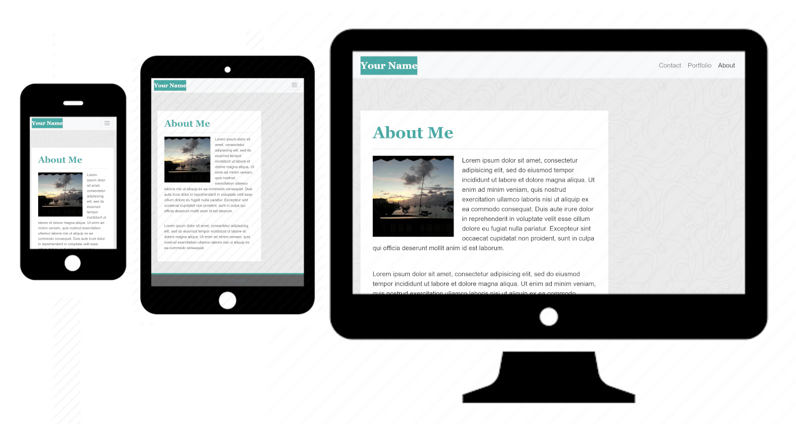

# Responsive portfolio project

### What this project is about
The purpose of this project was to create a responsive portfolio layout that performs on all viewport sizes without horizontal scrolling.

### Steps taken
* Utilized bootstrap for native responsiveness
* Tested webpages on various viewports via Chrome developer tools
* Attempted to minimize CSS and @media queries

### Deployed link
https://josh8903.github.io/02-responsive/

- - - 

Josh Thorngren
